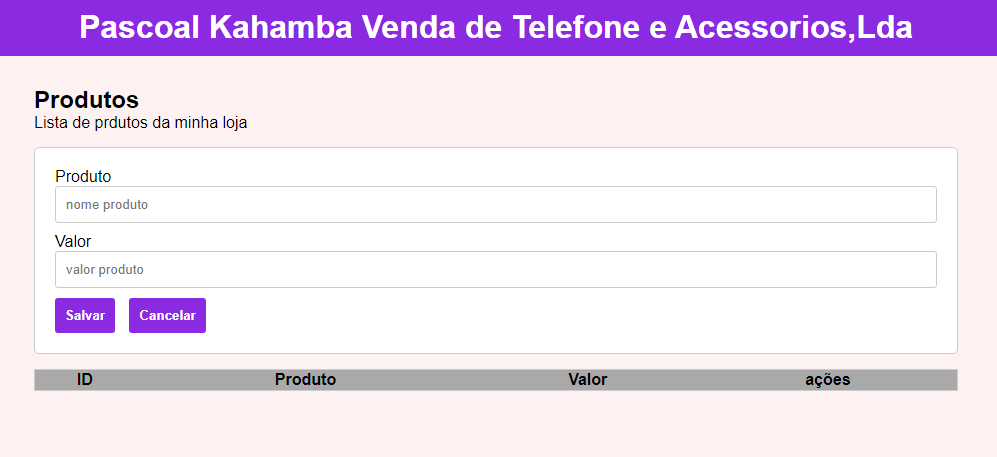
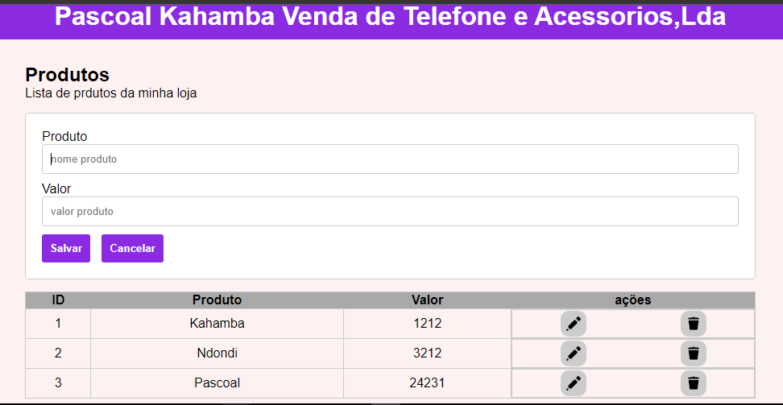

# Projeto adiciona produtos

Este `projeto` foi criado para fins de `exercicíos` para melhorar as minhas `habilidades` em `Javascript` especificamente em `Programação Orientada a Objetos`, então é um projeto que tem o função de `adicionar` `editar` e `excluir` `produtos` de uma determinada lista ele pedi simplesmente o nome e valor do produto assim que o `usuário` clicar em `salvar` vai adicionando produtos na sua `lista` pode também `cancelar` se não quiseres adicionar um certo produto, em `suma` o projeto funciona desta forma.

## Tecnologias

As seguintes ferramentas foram usadas na constuição deste projeto:

- HTML
- CSS
- JAVASCRIPT

#

Feito por ❤ Pascoal Kahamba meu [Linkedin](https://www.linkedin.com/in/pascoal-kahamba-7b43bb233?lipi=urn%3Ali%3Apage%3Ad_flagship3_profile_view_base_contact_details%3BTg8LEKayToyytOX1pVAQ%2Bg%3D%3D)

[👉Clique aqui para rodar o projeto👈](https://projeto-adiciona-produtos.vercel.app/)😎
